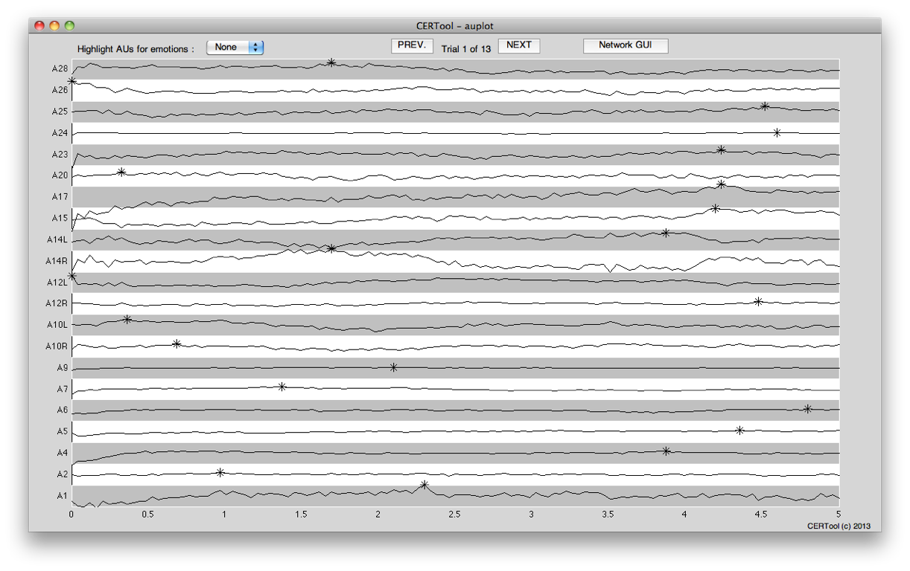
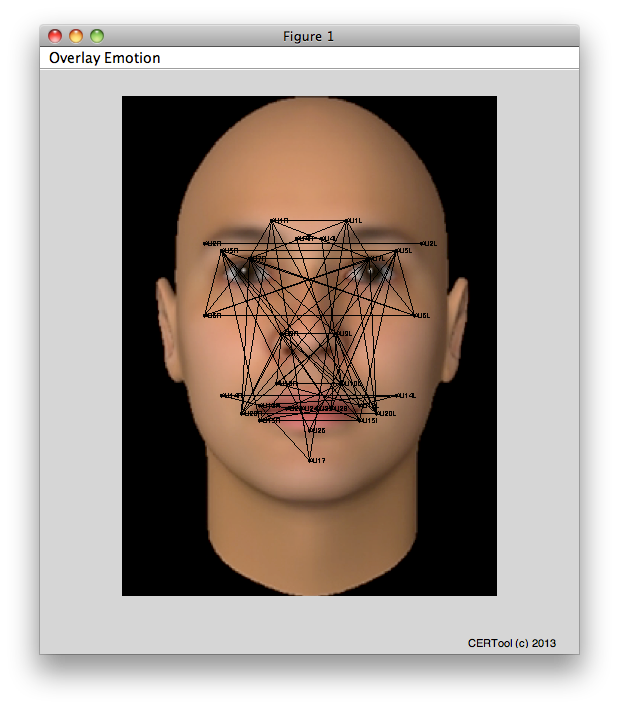
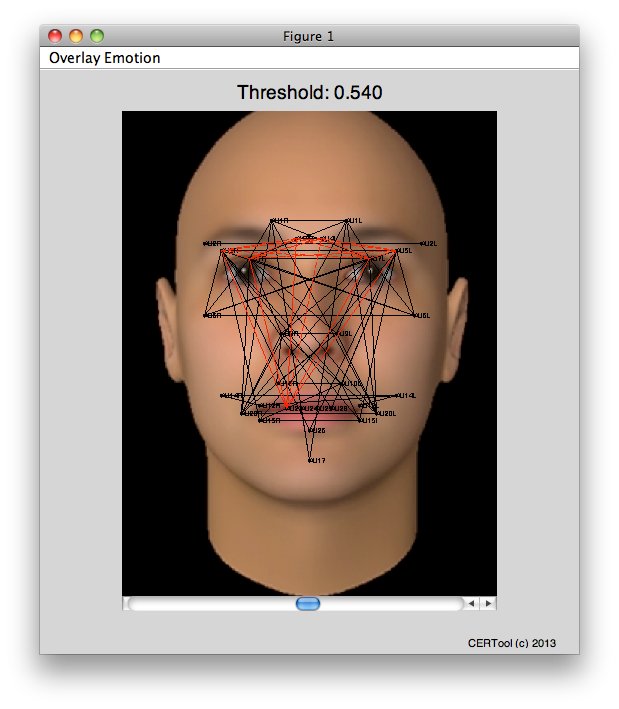

##CERTool

This tool provides the basic functionality for reading and processing [CERT data](http://mplab.ucsd.edu/~marni/Projects/CERT.htm) data in order to construct **Fa**cial e**X**pr**e**ssion **N**etworks (FaXeN)

It can be used to construct networks based on the [joint activation of facial action units (AU)](https://de.wikipedia.org/wiki/Facial_Action_Coding_System) and correlate them with basic emotions.

### Screenshots

#### Scrollplot for inspection of raw data

####Basic cross-activation/network

#### Overlayed emotion template

